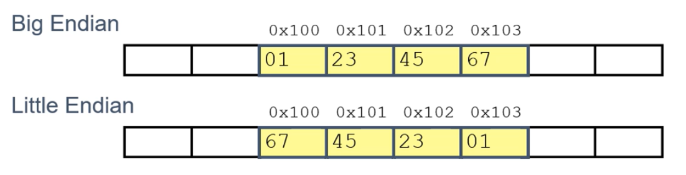

# The following includes notes on my System-Programming course in 2021-1

Feb 24

## Byte Ordering (Big & Little Endian)

Little Endian - Least significant byte has lowest address.
Big Endian - Least significant byte has highest address

Example 
- A variable `x` has a 4-byte representation of 0x01234567
- Address given by `&x` is `0x100`



## Code to Print Byte Representation of Data
- Casting pointer to an **unsigned char\*** allows treatment a a byte array.
```c
typedef unsigned char *pointer;

void show_bytes(pointer start, size_t len) {
	size_t i;
	for (i = 0; i < len; i++)
		printf("%p\t0x%x\n", start+i, start[i]);
	printf("\n");
}
```
An `int` is four bytes long. The `show_bytes` function recieves the starting address of the int value (15213 in this case) and the size of the data type (int, so 4 bytes). 
Results:
```
int a = 15213;
0x7fff78425704  0x6d
0x7fff78425705  0x3b
0x7fff78425706  0x0
0x7fff78425707  0x0
```
Since the architechture used here is Linux x86-64, each individual address above is 8 bytes long. 

## strings in C
Strings should be null-terminated. The final character of a string should be 0 (null). 
On a side note, byte ordering is not an issue for arrays when it comes to compatibility. Byte ordering becomes an issue within a single byte, but with arrays, the bytes are ordered sequentially.

## Byte Ordering example
```c
#include <stdio.h>

union {
	int i;
	unsigned char c[4];
} u;

int main() {
	u.i = 0x12345678;
	printf("%x %x %x %x\n", u.c[0], u.c[1], u.c[2], u.c[3]);
}
```
Output:
```
78 56 34 12
```
Unions in c are a special data type where different data types are allowed to be stored in the same memory location. A union can be defined with many members, but only one member can contain a value at any given time. [sort of paraphrased from tutorialspoint.com](https://tutorialspoint.com/cprogramming/c_unions.htm)

In the simple program above, u.i is assigned a hexadecimal value of 0x12345678, and upon printing the value stored in u.c[0..3] of the same union, the output of the program can be seen to be the above hexadecimal value, *reversed*.
---
